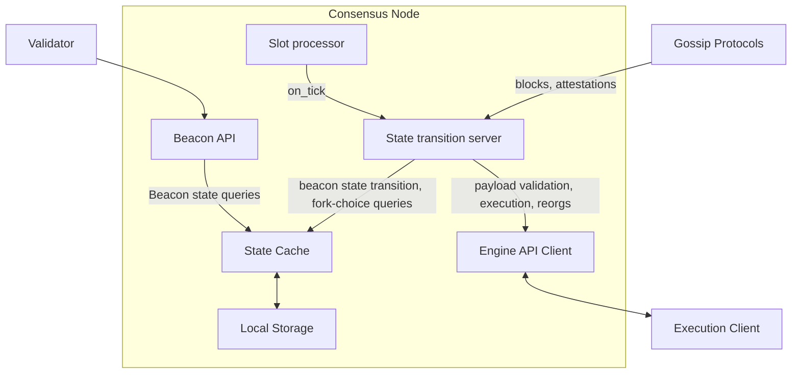

# Building a consensus node in elixir

## Motivation

The strength of the Ethereum ecosystem lies in its reliability through diversity, encompassing both technological and human dimensions. To date, however, the development of Ethereum clients has been predominantly spearheaded by European and North American teams. This has inadvertently centralized knowledge, contributions, and maintenance, which runs counter to Ethereum's foundational ethos of decentralization. Recognizing the critical nature of client diversity—which faces challenges intermittently—we are convinced that our LambdaClass Consensus client can make a significant impact. We aim not just to build, but to build differently, thereby promoting a truly global Ethereum community.

In the coming months, our objective is to develop a fully open-source client, led by a passionate team from Latin America—a region where the relevance and need for such technologies have been accentuated by local instabilities. Enhancing diversity not only invites broader participation in Ethereum but also fortifies the protocol's resilience. This is achieved by incorporating a myriad of contexts and legal frameworks of regions where the protocol's core contributors are based, thus mitigating potential regulatory challenges. Our emphasis is on nurturing community involvement. 

From a technical perspective, we've decided to construct our new consensus client using the Elixir programming language. Renowned for its focus on concurrency, availability, fault tolerance, and stability, Elixir is a functional language powered by the Erlang VM. These attributes make it an ideal candidate for implementing an Ethereum consensus client.

Our deep appreciation for Elixir drives our ambition to cultivate a vibrant Ethereum Elixir community, reminiscent of the thriving Rust Ethereum community which we've witnessed flourish and have actively contributed to over recent years. Elixir's emphasis on code readability and its straightforward implementation strategy allow us to set a clear objective: to make our client not only an exemplary piece of technology but also a valuable educational tool. We aim for it to be a comprehensive resource for learning the protocol specifications, understanding Ethereum's inner mechanisms, contributing to the core protocol, and implementing those specifications.

Aligned with Ethereum's dedication to open-source collaboration, we envision our client serving as a launchpad for extensive protocol contributions, truly embodying the ethos of "by the people, for the people."

## Project description

The philosophy behind this project relies on:

- **Team Expertise:** We're committed to curating a robust team well-versed with the entire consensus specifications. Our aim is for this team to serve as a beacon of knowledge and a reliable reference point for the entire community.
  
- **Transparent Open Source Approach:** Our project stands as an open book. Every aspect, from our daily progress, roadmap, and issue logs, will be accessible to the public, fostering open collaboration, contribution, and feedback. Such transparency paves the way for external involvement right from the inception, a sentiment we're proud to have achieved even at this early stage.

- **Production-Readiness from Day One:** We envision our maiden release to be immediately usable. Simply executing `make run` should bring to life a functional node that can receive and store blocks. It will be seamlessly integrated with the execution layer, and the beacon API will be operational for rudimentary beacon state queries. This approach nudges us to rapidly iterate, home in on tangible solutions, and remain vigilant against potential bugs and integration challenges.

- **Clarity in Code:** Our goal is a streamlined, comprehensible, and functional codebase. We prioritize a design where anticipated errors are proactively handled rather than merely "caught". The inherent capabilities of Elixir facilitate efficient scheduling between processes and requests that might exhibit diverse loads. Furthermore, its architecture ensures that individual components can crash and recover independently while preserving overall system resilience [1].

## Specification

This is a high level architecture diagram on the solution.

### Technical Details

1. **API Frameworks**:
   - **Beacon API**: Utilizes the Phoenix framework.
   - **Engine API Client**: Implemented using Tesla.

2. **Storage**:
   - **Cache and Local Storage**: Technologies are to be determined (TBD).

3. **Gossip Message Processing**:
   - Messages can be processed in parallel through snappy decompression and SSZ deserialization, provided that the state transition remains sequenced.

4. **State Transition Server**:
   - This is the most critical component. 
   - Primary Responsibility: Sequencing the incoming gossip messages and initiating the state transition functions.
   - The functions are integrated into a pure library.
   - We're evaluating multiple strategies, such as:
     - Using an OTP GenServer Leveraging an ETS key-value store as a cache over an SQL storage

## Roadmap

**1. Block Subscription - Mid September**
   - Libp2p discovery and block retrieval
   - SSZ + snappy
   - `on_block` callback: Save the latest block in fork-choice store, conduct basic checks. GetHead returns the last obtained block.
   - Beacon API: Return block root (`GET /beacon/states/{state_id}/root`)

**2. Checkpoint Sync - October**
   - Libp2p primitives for sync
   - Support checkpoint Sync from a known provider
   - Sync from the latest finalized block
   - BeaconAPI: Return headers for head block
   - EngineAPI: Validate incoming blocks

**3. Attestations - Mid October**
   - Libp2p attestation retrieval
   - Basic beacon state representation
   - Store attestations (last message sent by each validator)
   - `on_attestation` callback for attestations sent via Gossip
   - Process attestations from blocks
   - Beacon API: Return head block root (`GET /beacon/states/head/root`)

**4. Deposits - November**
   - BLS signature checks
   - Update consensus state view of deposit contract (`process_eth1_data`)
   - Process deposit operation to update validator list (`process_deposit`)
   - Verify block signatures (`verify_block_signature`)

**5. Slots and Fork-choice - Mid November**
   - `on_tick`/`process_slot` in state transition; a GenServer that calls this periodically
   - `on_block`: Add slot-related checks and epoch calculations (excluding finalization)
   - Get-head uses the messages
   - Block header validation
   - EngineAPI: Process execution payload
   - BeaconAPI: Ensure getting head values point to the heaviest

**6. Finality and Slashing - Mid November**
   - Epoch processing
   - `on_block`: Prune fork-choice store; reject blocks before finalization
   - Add RANDAO mix to the beacon state
   - BeaconAPI: Retrieve finality checkpoints, randao mixes
   - Process attester slashings and proposer slashings
   - EngineAPI: fork-choice updates

**7. Rewards, Shuffling - December**
   - Process rewards `on_epoch` for a checkpoint
   - Handle Deposits and Withdrawals
   - Implement RANDAO
   - Calculate committee for a given state
   - Conduct shuffling
   - Integrate with Grafana
   - BeaconAPI: Retrieve randao mix for a given block 

**8. Validator Features - Mid December/January 2024**
   - Create attestations
   - Monitor for slashings
   - Create slashing proofs
   - BeaconAPI: Post blocks, slashings, voluntary exits, and withdrawals

## Anticipated Challenges

### Technical Challenges:

- **Language-Specific Support:** Compared to other languages, there might be limited direct support in Elixir for key components like BLS, cryptographic primitives, libp2p, and SSZ. While we intend to develop native bindings for certain features, others will require us to code from scratch (which is the final goal, to push implementation diversity further).
  
- **Load Testing Limitations:** Thorough load testing, while accounting for the constraints of standard computer hardware, could pose challenges.

- **Optimal Storage Solutions:** The storage design for the beacon state and fork-choice store isn't explicitly detailed in the specs. Identifying and validating the most efficient storage solution from the myriad of options will be essential.

- **Cross-Testing Compatibility:** It's imperative to ensure compatibility by cross-testing our client with all existing execution clients.

### Human Challenges:

- **Skill Enhancement:** Acclimating a team to the intricate details of Ethereum specifications is no small feat. It requires sustained effort and patience. This steep learning curve might deter some external collaborators if it hampers their ability to engage swiftly with issues.

- **Distinguishing Features:** To ensure a wider adoption, we need to identify unique features that would make our client more appealing. This could encompass enhanced observability or other standout features that reinforce our client's value proposition.

- **Fostering a Resilient Community:** Establishing a community that's not just enduring, but also well-informed about forthcoming protocol changes and actively eager to further the growth and innovation of the Ethereum protocol will be paramount.

## Goal of the project

Our benchmark for success is clear and ambitious. By the culmination of the fellowship, we aspire to have a node that seamlessly syncs with the current beacon state and correctly calculates fork-choices. While support for rewards calculation and validators will be incorporated post-fellowship, our aim during this journey is to lay a robust foundation.

## Collaborators

### Fellows 

In github username alphabetical order.

- Tomás Arjovsky (@arkenan)
- Tomás Grüner (@megaredhand)
- Martín Paulucci (@mpaulucci)
- Paul-Henry Kajfasz (@phklive)

### Mentors

- Mikhail Kalinin @mkalinin

## Resources

[Lambdaclass Ethereum Consensus Client Github repository](https://github.com/lambdaclass/lambda_ethereum_consensus/)

**Books**:
- [Elixir in Action](https://www.manning.com/books/elixir-in-action-third-edition)
- [Learn You Some Erlang](https://learnyousomeerlang.com/)
- [Eth2Book by Ben Edgington](https://eth2book.info)
- [Inevitable Ethereum](https://inevitableeth.com/site/content)

**Videos**:
- [Intro to Elixir](https://youtube.com/playlist?list=PLJbE2Yu2zumA-p21bEQB6nsYABAO-HtF2)
- [Hitchhiker's tour of the BEAM](https://www.youtube.com/watch?v=_Pwlvy3zz9M)
- [Basic technical details of Ethereum](https://youtu.be/gjwr-7PgpN8)
- [Ethereum in 30 minutes](https://youtu.be/UihMqcj-cqc)
- [Ethereum Foundation youtube channel](https://www.youtube.com/@EthereumFoundation)
- [Ethereum youtube channel](https://www.youtube.com/@EthereumProtocol)
- [Yellow paper discussion](youtube.com/watch?v=e84v1mxrlys)

**Blogs**:
- [Zen of Erlang](https://ferd.ca/the-zen-of-erlang.html)
- [Where Erlang Blooms](https://ferd.ca/rtb-where-erlang-blooms.html)
- [What can I only do in Erlang](https://hackmd.io/ZpUazPomRvacKoyW2vq54g)
- [Stacking theory for systems design](https://medium.com/@jlouis666/stacking-theory-for-systems-design-2450e6300689)
- [On Erlang States and Crashes](http://jlouisramblings.blogspot.com/2010/11/on-erlang-state-and-crashes.html)
- [How Erlang does scheduling](http://jlouisramblings.blogspot.com/2013/01/how-erlang-does-scheduling.html)
- [Vitalik Buterin's blog](https://vitalik.ca/)
- [Ethereum Foundation blog](https://blog.ethereum.org/)
- [Ethereum Magicians forum](https://ethereum-magicians.org/)
- [Ethresear.ch forum](https://ethresear.ch/)
- [EIP's](https://eips.ethereum.org/)
- [ACD & Related meetings](https://github.com/ethereum/pm)

**Papers**:
- [Ethereum Whitepaper](https://ethereum.org/en/whitepaper/)
- [Ethereum Yellowpaper](https://ethereum.github.io/yellowpaper/paper.pdf)
- [Yellow paper walkthrough](https://www.lucassaldanha.com/ethereum-yellow-paper-walkthrough-1/)
- [Ethereum Beige Paper](https://github.com/chronaeon/beigepaper/blob/master/beigepaper.pdf)
- [Ethereum Mauve Paper](https://cdn.hackaday.io/files/10879465447136/Mauve%20Paper%20Vitalik.pdf)

**Specifications**:
- [Consensus specs](https://github.com/ethereum/consensus-specs)
- [Vitalik Buterin's annotated specs](https://github.com/ethereum/annotated-spec)
- [Eth2Book annotated specs](https://eth2book.info/capella/part3/)

## Bibliography:
[1] https://ferd.ca/the-hitchhiker-s-guide-to-the-unexpected.html 
