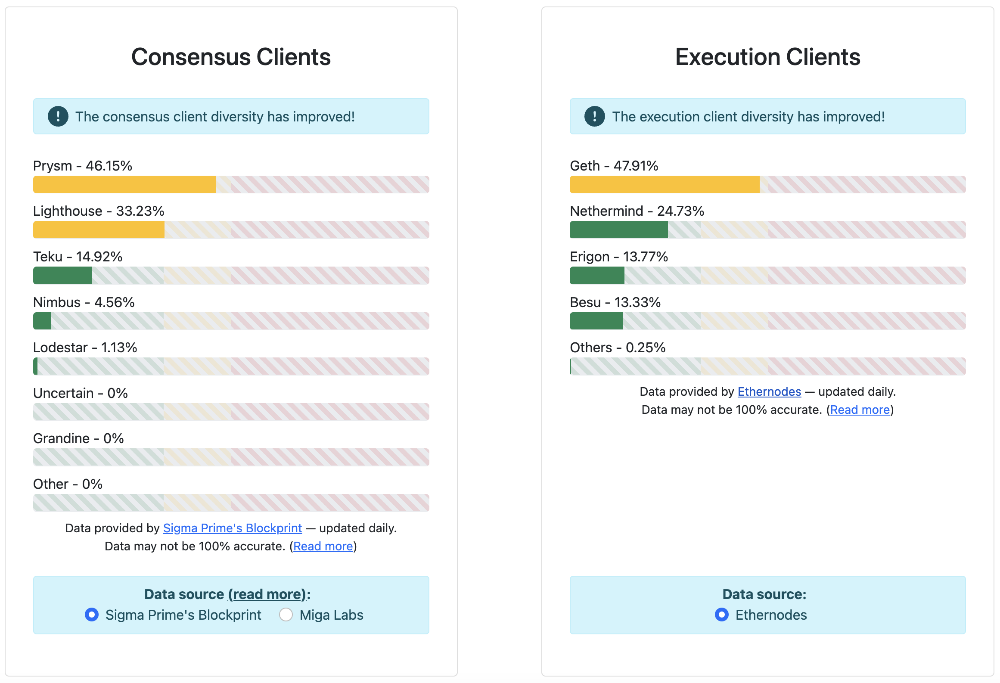
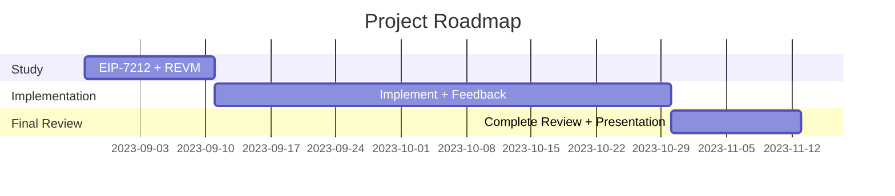

# Project Proposal

Become a core contributor for [Reth](https://github.com/paradigmxyz/reth), a new Ethereum execution client written in Rust!

## Motivation

Client diversity is one of the most important features of Ethereum as it helps to further decentralise the network. Right now there are already several implementations for the Ethereum protocol, divided in consensus and execution clients, as you can see from the image below.

Reth is an execution client and it’s the first one written in the Rust language, another good thing since it creates diversity also on the programming languages used for Ethereum clients. It aims to be very fast (Rust language is known for its speed and reliability) and optimised in order to be able to satisfy different users:

- big companies who need power and speed, have lots of money to invest in machines and infrastructures.
- normal users who just want to run their own node with a normal computer.

I am really excited to contribute to such a significant software project. Working on it lets me study and gain deep knowledge of various aspects of the Ethereum protocol.

## Project description

My project for this EPF is divided into two parts:

1. Create an implementation of [EIP-7212](https://eips.ethereum.org/EIPS/eip-7212) for Reth. This EIP aims to introduce a precompile for elliptic curve operations on the ”*sepc256r1*” curve, which is different from the ”*sepc256k1*” used on Ethereum (and Bitcoin) for signatures verification.
2. Solve a lot of smaller issues on the Reth repo, covering various aspects of the protocol and of an Ethereum node.

## Specification

### EIP-7212

As of `FORK_TIMESTAMP` in the integrated EVM chain, add precompiled contract `P256VERIFY` for signature verifications in the “*secp256r1*” elliptic curve at address `PRECOMPILED_ADDRESS` in `0x19`.

// **TODO**: I have to study further this EIP and start planning a more concrete specification and documentation of it.

### Smaller Issues

Every smaller issue has its own mini-proposal within the overall project proposal outlining the problem statement, proposed solution, and challenges.

// THIS IS A WORK-IN-PROGRESS LIST

[**add defaults to some rpc server cli args**](Reth_contributor/add_defaults_to_some_rpc_server_cli_args.md)

[**feat: store logs in different folders based on the chain**](Reth_contributor/feat_store_logs_in_different_folders_based_on_the_chain.md)

[**ask for confirmation during reth db drop**](Reth_contributor/ask_for_confirmation_during_reth_db_drop.md)

[**feat: add rpc server metrics into dashboard**](Reth_contributor/feat_add_rpc_server_metrics_into_dashboard.md)

[**feat: add flag to CLI to disable colour coding of console output**](Reth_contributor/feat_add_flag_to_CLI_to_disable_colour_coding.md)

## Roadmap

### EIP-7212

### Smaller Issues

Each issue has its own mini-roadmap associated to it.

## Possible challenges

- Understand very well EIP-7212 and especially Revm, which is the EVM implementation used by Reth. Also EIP-7212 is still in review and could have breaking changes so I have to keep updated on that. EIP. It shouldn’t be an hard problem but this is for sure the first challenge I will have to overcome.
- Reth repo is very active and issues are sniped very fast so it’s not super easy to be able to work on every open issue.
- Reth is a huge project (since it is a full Ethereum execution client) and it’s not easy to learn all its aspects and functionalities. This could be a problem to solve some very hard issues.

## Goal of the project

### EIP-7212

I want to have at least a draft implementation of EIP-7212 for Reth. Something that can be not perfectly optimised yet but that works properly.

### Smaller Issues

It’s not very easy to predict a clear goal for solving smaller issues since they are all different and can take more or less time, but my general idea is to solve an average of at least one issue per week (2 weeks if it’s a bigger and longer one).

It’s also important to note that often you need to wait some time for reviews so my plan is to usually work on several issues at the same time so that I can switch between them when I receive some feedback or reviews.

## Collaborators

### Fellows

[Alessandro Mazza](https://github.com/alessandromazza98)

### Mentors

[Georgios Konstantopoulos](https://github.com/gakonst)

## Resources

1. [Reth repo](https://github.com/paradigmxyz/reth)
2. [EIP-7212](https://eips.ethereum.org/EIPS/eip-7212)
3. [EIP-7212 discussion](https://ethereum-magicians.org/t/eip-7212-precompiled-for-secp256r1-curve-support/14789)
