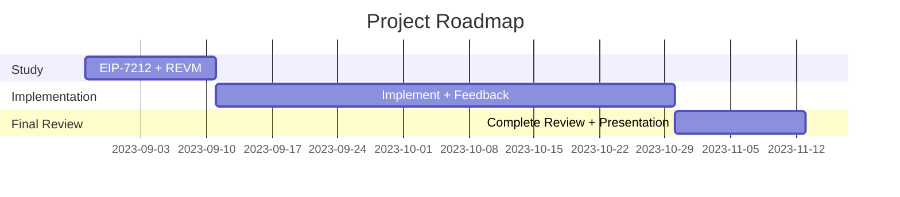

# Project Proposal

Become a core contributor for [Reth](https://github.com/paradigmxyz/reth), a new Ethereum execution client written in Rust!

## Motivation

Client diversity is one of the most important features of Ethereum as it helps to further decentralise the network. Right now there are already several implementations for the Ethereum protocol, divided in consensus and execution clients, as you can see from the image below.


Reth is an execution client and it’s the first one written in the Rust language, another good thing since it creates diversity also on the programming languages used for Ethereum clients. It aims to be very fast (Rust language is known for its speed and reliability) and optimised in order to be able to satisfy different users:

- big companies who need power and speed, have lots of money to invest in machines and infrastructures.
- normal users who just want to run their own node with a normal computer.

I am really excited to contribute to such a significant software project. Working on it lets me study and gain deep knowledge of various aspects of the Ethereum protocol.

## Project description

My project for this EPF is divided into two parts:

1. Create an implementation of [EIP-7212](https://eips.ethereum.org/EIPS/eip-7212) for Reth. This EIP aims to introduce a precompile for elliptic curve operations on the ”*sepc256r1*” curve, which is different from the ”*sepc256k1*” used on Ethereum (and Bitcoin) for signatures verification.
2. Solve a lot of smaller issues on the Reth repo, covering various aspects of the protocol and of an Ethereum node.

## Specification

### EIP-7212

As of `FORK_TIMESTAMP` in the integrated EVM chain, add precompiled contract `P256VERIFY` for signature verifications in the “*secp256r1*” elliptic curve at address `PRECOMPILED_ADDRESS` in `0x19`.

// **TODO**: I have to study further this EIP and start planning a more concrete specification and documentation of it.

### Smaller Issues

Every smaller issue has its own mini-proposal within the overall project proposal outlining the problem statement, proposed solution, and challenges.

// THIS IS A WORK-IN-PROGRESS LIST

<details>
  <summary>add defaults to some rpc server cli args</summary>

  PR: https://github.com/paradigmxyz/reth/pull/3969  

  **Motivation**  
  The following fields of `RpcServerArgs` do not have to be an `Option`.

  - `auth_addr`
  - `ws_addr`
  - `ws_port`
  - `http_addr`
  - `http_port`

  **Project Description**  
  Add a default value so it can be displayed in help and remove the Option.  

  **Specification**  
  First I studied the `clap` crate in order to be able to understand the issue and solve it easily. You can find my documentation about it here: [Clap crate](https://www.notion.so/Clap-crate-393be7f219514973a333f8608116dcbd?pvs=21).

  Then I just added the `default_value_t` annotation in all of the above mentioned fields with its correspondent value:

  - `IpAddr::V4(Ipv4Addr::LOCALHOST)` for ip addresses
  - `constants::DEFAULT_HTTP_RPC_PORT`
  - `constants::DEFAULT_WS_RPC_PORT`

</details>

<details>
  <summary>feat: store logs in different folders based on the chain</summary>

  PR: https://github.com/paradigmxyz/reth/pull/3948  

  **Motivation**  
  Currently logs are output to ~/.cache/reth/logs/reth.log, even if there are multiple nodes running on different chains.

  **Project Description**  
  Instead, logs should be output to `~/.cache/reth/logs/<chain>/reth.log`, or moved to the already-chain-specific `--datadir`. For example:

  `~/.cache/reth/logs/mainnet/reth.log`

  `~/.cache/reth/logs/sepolia/reth.log` 

  **Specification**  
  When `--log.persistent` flag is enabled, logs are now stored in different folders based on the chain or in the already-chain-specific `--datadir`.

  Examples (no `--datadir` flag):

  `~/.cache/reth/logs/mainnet/reth.log`

  `~/.cache/reth/logs/sepolia/reth.log`

  Examples (with `--datadir` flag):

  `~/custom-data-dir/reth.log`

  In order to do that, I added a `chain` field in the `Cli` struct with the `global = true` annotation and made the logs folder be based on that specific flag.

  ```rust
  // add network name to logs dir
  self.logs.log_directory = self.logs.log_directory.join(self.chain.chain.to_string());
  ```

</details>

<details>
  <summary>ask for confirmation during reth db drop</summary>

  PR: https://github.com/paradigmxyz/reth/pull/4118  

  **Motivation**  
  It's a shame when a fully synced mainnet database is accidentally deleted.

  **Project Description**  
  Let's ask for the interactive confirmation by default and add a -f / --force flag to explicitly bypass this confirmation.

  **Specification**  
  Add a `-f`/ `--force` flag to the `reth db drop` command. If not passed by the user, it always asks for confirmation before dropping the db. If the user passes the `-f`/`--force` flag it bypasses the confirmation and immediately drops the db.

  I added a bool argument `force` to the `Drop` subcommand and made the logic be dependent on that value: if it is set (to true), then when you call the drop subcommand it immediately drops the database. Otherwise it asks for confirmation before dropping it.

</details>

<details>
  <summary>feat: add rpc server metrics into dashboard</summary>

  PR: https://github.com/paradigmxyz/reth/pull/4078  

  **Motivation**  
  New set of metrics for rpc server added in #3913 but are currently not tracked in the grafana dashboard.

  **Project Description**  
  Integrate in dashboard:

  - active requests
  - histogram
  - active websocket connections

  **Specification**  
  I added all those metrics in three different charts using standard Grafana JSON format. Actually I had never worked on grafana metrics so it was very interesting to understand how that works in details and be able to create dashbaords based on metrics exposed by Reth.

</details>

<details>
  <summary>feat: add flag to CLI to disable colour coding of console output</summary>

  PR: https://github.com/paradigmxyz/reth/pull/4033  

  **Motivation**  
  Add cli flag that is going to disable the colour coding of console output, it is particularly annoying with docker logs that would contain ansci encoding.

  **Project Description**  
  Add cli flag that is going to disable the colour coding of console output, it is particularly annoying with docker logs that would contain ansci encoding.

  **Specification**  
  I added a `color` flag to the `Cli` struct that accepts three different `ColorMode`:

  - `always`: colors on.
  - `auto`: usually does some environment detection, but for now it's ok if it just behaves as `always`.
  - `never`: colors off.

  Then I changed the signature of the logs tracing function to also accept a `ColorMode` and set colors accordingly.

</details>

## Roadmap

### EIP-7212



### Smaller Issues

Each issue has its own mini-roadmap associated to it.

## Possible challenges

- Understand very well EIP-7212 and especially Revm, which is the EVM implementation used by Reth. Also EIP-7212 is still in review and could have breaking changes so I have to keep updated on that. EIP. It shouldn’t be an hard problem but this is for sure the first challenge I will have to overcome.
- Reth repo is very active and issues are sniped very fast so it’s not super easy to be able to work on every open issue.
- Reth is a huge project (since it is a full Ethereum execution client) and it’s not easy to learn all its aspects and functionalities. This could be a problem to solve some very hard issues.

## Goal of the project

### EIP-7212

I want to have at least a draft implementation of EIP-7212 for Reth. Something that can be not perfectly optimised yet but that works properly.

### Smaller Issues

It’s not very easy to predict a clear goal for solving smaller issues since they are all different and can take more or less time, but my general idea is to solve an average of at least one issue per week (2 weeks if it’s a bigger and longer one).

It’s also important to note that often you need to wait some time for reviews so my plan is to usually work on several issues at the same time so that I can switch between them when I receive some feedback or reviews.

## Collaborators

### Fellows

[Alessandro Mazza](https://github.com/alessandromazza98)

### Mentors

[Georgios Konstantopoulos](https://github.com/gakonst)

## Resources

1. [Reth repo](https://github.com/paradigmxyz/reth)
2. [EIP-7212](https://eips.ethereum.org/EIPS/eip-7212)
3. [EIP-7212 discussion](https://ethereum-magicians.org/t/eip-7212-precompiled-for-secp256r1-curve-support/14789)
