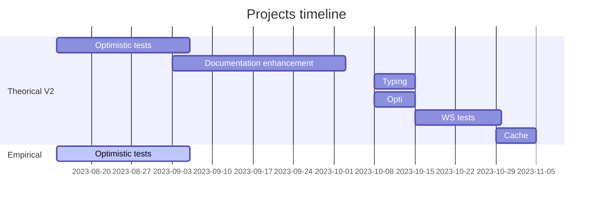

# Consensus-specs wish-list

Enhance the [consensus-specs](https://github.com/ethereum/consensus-specs) repository.

## Motivation

The consensus-specs is the repository that describes how the Ethereum PoS works; each consensus client refers to this project. This repository stores the consensus specification, the discussions of the consensus and the test vectors consume by the client implentation. This is a very important tool that contribute to the client diversity.

A special thanks to [HwwHww](https://github.com/hwwhww) that helps me to create this project form.

## Project description

This project aims to do many "small" things:
- Enhance the documentation.
- Try to optimize [remerkleable](https://github.com/protolambda/remerkleable), a consensus-specs dependency.
- Add missing tests for the weak subjectivity.
- Add more sophisticated tests for the optimistic sync.

 
## Specification

I will implement the below (in the following order):
1. **Sophisticate optimistic sync tests**: the idea is to complete the scenarios of [`test_optimistic.py`](https://github.com/ethereum/consensus-specs/blob/dev/tests/core/pyspec/eth2spec/test/bellatrix/sync/test_optimistic.py). First I will take 4-5 days to work on the optimistic sync to understand what it implies + discover the current set of developed tests. [HwwHww](https://github.com/hwwhww) told me to contact Mikhail (a mentor) to help me design test case scenarios. The test development it self won't be complicated since I know how the test generation works, it's more about what must be tested.
2. **Enhance the documentation website**: the goal is to list all test cases in the [documentation website](https://ethereum.github.io/consensus-specs/) the same way it is done in the [execution-specs documentation website](https://ethereum.github.io/execution-spec-tests/tests/). What I am going to do is first to understand how the documentation website is generated and then implement something similar to [this](https://github.com/ethereum/execution-spec-tests/blob/4c402abcac4d13efde9f2a67f9a70363088d70a5/docs/gen_test_case_reference.py) for the consensus-sepcs. Also, I will improve the documentation content by first listing every `README.md` in the repository and to re-organized them into the [doc folder](https://github.com/ethereum/consensus-specs/tree/dev/docs/docs). Finally, I will update some `README.md` that are not update to date.
3. **Complete Mypy typings in `remerkleable`**: Pythons is a dynamic typed language; Mypy allows user to check that they are using the expected type for a given scope. In the current `remerkleable` version, it is not possible to add Mypy **full** typing checks because of some SSZ complex types (`List` and `Vector`). Since it's been a while since the last test was done, I will have a look if the latest Mypy version can be compatible. I never used Mypy so I will first exerce myself and then try to make it works.
4. **Try to optimize `hash_tree_root` in `remerkleable`**: `hash_tree_root` is a one fo the performance bottlenecks according to [HwwHww](https://github.com/hwwhww); it means test generator can be improved by optimizing the method `hash_tree_root` in `remerkleable`. I am not super confident I will find a way to improve this since it's already well developed; but I will try debug the code and see if there is any trick to increace performance that can be done. I will try one week, not more. When done (if done), I will compare test generation  computation time before/after.
5. **Implement weak subjectivity tests**: weak subjectivity tests is the only corner not covered by tests vectors. The idea here is to understand what is the weak subjectivity (1-2 days) and then add the tests; I will need to draft test senarios, that I will complete with [HwwHww](https://github.com/hwwhww) ideas. I already understand how the test generation works with some work on issues related to test generator so I won't be lost when I will start to implement those tests.
6. **Look for helpers method to cache**: some helper methods in [`setup.py`](https://github.com/ethereum/consensus-specs/blob/8d6a40522c00d7f7ea25d841208342212e1e2367/pysetup/spec_builders/phase0.py) (phase0 fork) are cached; I will check if there are others helper methods that can be cached in other forks. First I will list each herlper method used in each fork, see if their are very often used, and then cache them the same way it's done for the phase0 fork.

## Roadmap

The below timeline can be considered broad but I can only work during the evening and the weekend.

## Possible challenges

The most complicated chalenge will be to monitor time. As you can see above, every tasks are not huge neither super complicated, and doesn't require an entire EPR program to be done; but as an partial time fellow, it is going to be 4 complicated months.

## Goal of the project

This projet is special since it's a bunch of tasks, with different subject/scope. That's why if I can finish 5 over the 6 subjects, I will consider my participation as succesful.

## Collaborators

### Fellows 

[Wenceslas (0x5f3759df)](https://github.com/wenceslas-sanchez)

### Mentors

[hwwhww](https://github.com/hwwhww)

## Resources

- [consensus-specs repostitory](https://github.com/ethereum/consensus-specs)
- [execution-specs repostitory](https://github.com/ethereum/execution-specs)
- [remerkleable](https://github.com/protolambda/remerkleable)
