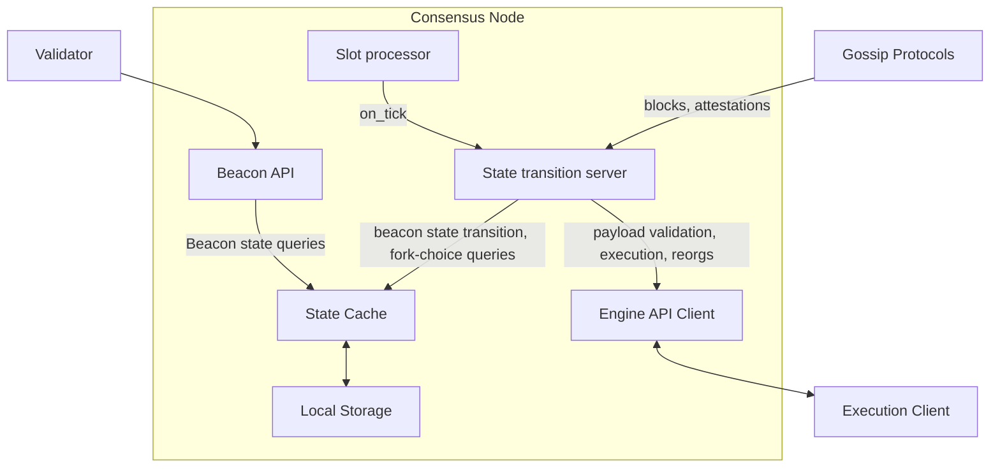

# Building a consensus node in elixir

## Motivation

The Ethereum ecosystem thrives on diversity, both on the technical and human levels, but most consensus and execution clients are coded by european or north american companies or teams. Our goal is to form a team of people working on core protocol features and Ethereum clients with a strong basis in Latin America. An open source approach from the start will also enable collaborators from all around the world to contribute to the project.

Extending participation on core features to countries in latin america has a two-way synergy. On the one hand, human diversity adds more resilience to the ethereum ecosystem: the diversity of contexts and laws where builders reside makes regulatory complications less likely. On the other hand, countries in Latin America and some African countries have a surprisingly high participation in the ecosystem due to monetary needs: high inflation, bringing the need of a censor-free, stable store of value, or sheer imposibility to buy international plane tickets, or sending money to relatives abroad, and many other cases. Nevertheless, that participation is highly user-driven and less oriented to core development, so an enormous amount of talent, different perspectives and academic/professional backgrounds can be discovered by extending core participation to those places.

On the technical level, we want to build a consensus client on a language which isn't very popular in the Ethereum ecosystem yet: Elixir. A functional, concurrency oriented language, very different from others like go, elixir or typescript. We want to make it the clearest, and easiest to understand and to participate in, and also the best documented one, so that if any new team wants to build their own client, they can start learning how to do so using ours.

## Project description

The phylosophy behind this project relies on:

- Building a fully open source project that can be audited not only from the perspective of code but also its process: everything from the dailies, and roadmap will be public and open for feedback. This will encourage external participation since day 1.
- Building software that's production-ready from milestone 1. We want the first release to have a `make run` that brings up a working node, receiving blocks and storing them, integrated with the execution layer and with the beacon API already available for basic beacon state queries. This forces us to iterate fast and always be alert for bugs and integration issues, instead of waiting until the last minute.
- Building a lean, functional code, where expected errors are handled instead of "catched", with the support of a managed supervision tree that revives nodes if they were to crash. Elixir is built to schedule between processes and requests that might vary in load and crash independently, while maintaining fault tolerance [1].

## Specification

This is a high level architecture diagram on the solution.

Some technical details:

- The Beacon API will be built using the Phoenix framework.
- The Engine API client will be built with Tesla.
- Cache and local storage technologies are TBD.
- The gossip messages can be processed in parallel (snappy decompressed, SSZ deserialized) as long as the state transition is sequenced. 
- The most critical part of the app is the state transition server. Its main task is to sequence the incoming gossip messages and calling the state transition functions, which will be part of a pure library. We're evaluating between several strategies, like an OTP GenServer over an ETS key-value store to act as a cache over an SQL storage.

## Roadmap

This is a rough sketch of the release plan:

1. Block subscription -> Mid september.
    1. Libp2p discovery and block retrieval
    2. SSZ + snappy.
    3. `on_block` callback just saves the latest block in the fork-choice store and does basic checks. GetHead just returns the last obtained block.
    4. Beacon API: returning block root (`GET /beacon/states/{state_id}/root`)
2. Checkpoint Sync. -> October
    1. Libp2p primitives for sync.
    2. Support checkpoint Sync from a known provider
    3. Syncing from the latest finalised block
    4. BeaconAPI: return headers for head block.
    5. EngineAPI: validate incoming blocks.
3. Attestations -> Mid october
    1. Libp2p attestation retrieval.
    2. Basic beacon state representation.
    3. Attestations as part of the store (last message sent by each validator).
    4. `on_attestation` callback for attestations sent via Gossip
    5. Attestation processing from blocks
    6. Beacon API: returning head block root (`GET /beacon/states/head/root`)
4. Deposits -> November
    1. BLS signature checks
    2. Update consensus state view of the deposit contract (`process_eth1_data`)
    3. Process deposit operation to update validator list (`process_deposit`)
    4. Verify block signatures (`verify_block_signature`)
5. Slots and Fork-choice -> Mid november
    1. `on_tick`/`process_slot` in state transition. GenServer that calls this periodically.
    2. `on_block`: add slot related checks and epoch calculations (not finalization).
    3. Get-head now uses the messages.
    4. Block header validation.
    5. EngineAPI: process execution payload.
    6. BeaconAPI: getting head values should point to the heaviest.
6. Finality and Slashing -> Mid november
    1. epoch processing.
    2. on_block: pruning of fork-choice store. Not accepting blocks before finalization.
    3. Add RANDAO mix to the beacon state.
    4. BeaconAPI: get finality checkpoints, randao mixes.
    5. Attester slashing processing
    6. Proposer slashing processing
    7. EngineAPI: fork-choice updates.
7. Rewards, shuffling -> December:
    1. Rewards processed on_epoch for a checkpoint.
    2. Deposits, withdrawals.
    3. RANDAO implemented.
    4. Committee calculation for a given state.
    5. Shuffling.
    6. Grafana.
    7. BeaconAPI: getting randao mix for a given block. 
8. Validator features -> Mid december/january 2024.
    1. Attestation creation
    2. Slashing monitors.
    3. Slashing proof creation.
    4. BeaconAPI: posting blocks, slashings, voluntary exits, withdrawals.

## Possible challenges

Technical challenges:

- Support from building blocks in elixir vs other languages, speciale BLS, crypto primitives, libp2p, SSZ. We'll build native bindings for some of those features, but some of them we'll need to code from a scratch.
- Load testing with the constraints of a regular computer and its hardware limitations.
- Performant storage. Storage of beacon state and fork-choice store is one of the components that's not defined in the specs and there's a number of possible solutions that need to be tested.
- Making sure we cross-test our client with all of the existing execution clients. 

Human challenges:

- Training a group of people in the specs, which takes a lot of time and may demotivate some external collaborators if it blocks them from participating in issues quickly.
- Discovering features that will be attractive to people using the client, like better observability, to have better possibilities for adoption.
- Building a community that lasts and is up-to-date with the upcoming protocol changes.

## Goal of the project

This project will be considered a success if, by the end of the fellowship, we have a node that can, at least, fully sync with the current beacon state and calculate fork-choice correctly. Rewards calculation and support for validators are nice-to-haves and may be included after the fellowship finishes.

## Collaborators

### Fellows 

In github username alphabetical order.

- Tomás Arjovsky (@arkenan)
- Tomás Grüner (@megaredhand)
- Martín Paulucci (@mpaulucci)
- Paul Henry Kajfasz (@phklive)

### Mentors

- TBC

## Resources

Node repo: https://github.com/lambdaclass/lambda_ethereum_consensus/

Bibliography:
[1] https://ferd.ca/the-hitchhiker-s-guide-to-the-unexpected.html 
